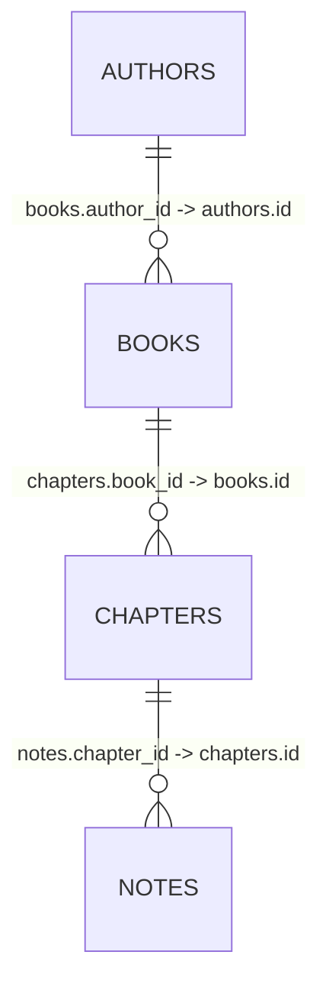
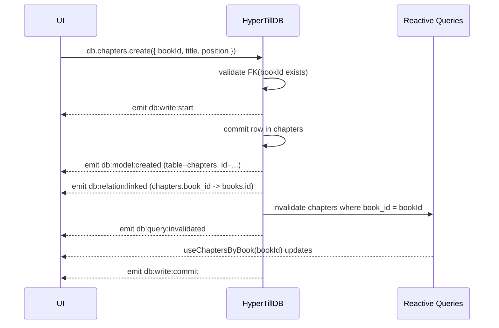
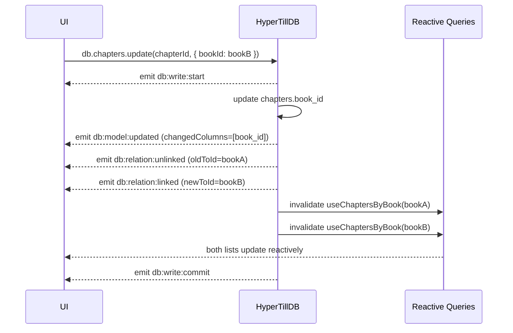
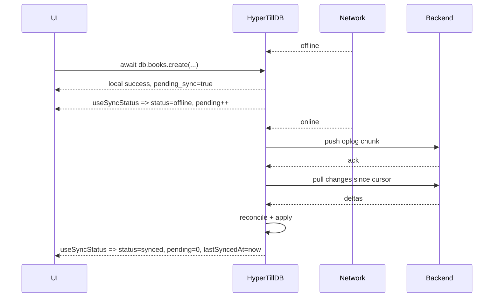
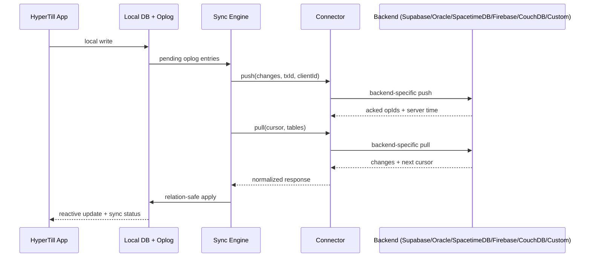
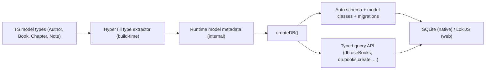
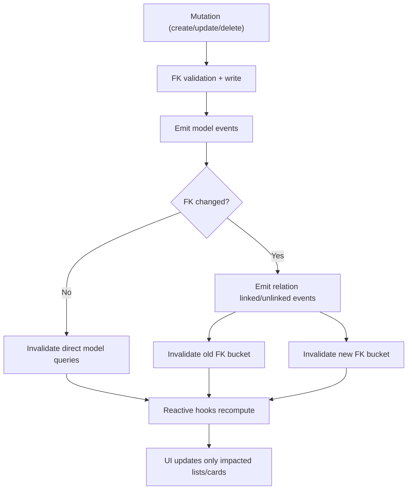

# HyperTillDB vNext: Type-First Simplicity Plan

## Why this document

This captures the current agreement for HyperTillDB vNext:

- Keep developer experience extremely simple.
- Remove duplicate definitions (`schema.ts`, Watermelon model classes, hand-written DB wrappers).
- Use TypeScript model types as the primary source of truth.
- Keep strict typing and safety (`any`/`unknown` not allowed).
- Handle migrations internally with smart defaults and explicit safety boundaries.

---

## Implementation status (March 3, 2026)

Implemented now in code (`src/typeFirst/*`):

- `dbModel<T>()` primitive with model options and relation metadata.
- `defineModels({...})` registry that resolves model names, tables, and relation foreign keys.
- `relation.Author()` style helper (plus callable `relation('table')` compatibility).
- `createDB({...})` runtime wrapper on top of reactive internals.
- root hooks like `db.useBooks(...)` and relation hooks like `db.useBooksByAuthorId(...)`.
- simplified mutation result shape:
  - `{ data, error, loading, status, progress }`
- default timestamp injection on writes (`created_at`, `updated_at`) and soft-delete mode support.

Still intentionally deferred:

- sync engine work (push/pull/connectors/conflict resolution)
- internal migration planner execution for destructive changes
- build-time TS type extraction transformer (current runtime still needs `dbModel<T>()` declarations)
- advanced relation cascade policies and server connector packs

---

## Current pain points (what we are removing)

Today app code still has too many moving parts:

1. `schema.ts` (manual table/column definitions)
2. `models/*.ts` (manual model classes)
3. `index.ts` and `index.web.ts` (manual adapter bootstrapping)
4. extra runtime wrapper layer to expose simple hooks

This duplicates model intent and increases maintenance cost.

---

## Target developer experience

The app should define types once, then create DB once.

```ts
// src/db/models.ts
export type Author = {
  name: string
  address?: string
  phone?: number
}

export type BookStatus = 'draft' | 'published' | 'archived'

export type Meta = {
  isbn?: string
  code: number
}

export type Book = {
  title: string
  authorId: string
  status: BookStatus
  tags?: string[]
  meta?: Meta
  publishedAt?: number
}
```

```ts
// src/db/index.ts
import { createDB, dbModel, defineModels } from '@onchez/hypertilldb'
import type { Author, Book } from './models'

export const models = defineModels({
  Author: dbModel<Author>(),
  Book: dbModel<Book>(),
})

export const db = createDB({
  name: 'books-app',
  models,
  migration: {
    mode: 'smart',
    autoDefaults: true,
    detectRename: 'same-type-one-to-one',
  },
})
```

Usage should be type-safe and ergonomic:

```ts
const books = db.useBooks({
  where: { authorId },
  orderBy: { title: 'asc' },
})

await db.books.create({ title: 'Deep Work', authorId, status: 'draft' })
await db.books.update(bookId, { status: 'published' })
```

No manual `schema.ts` and no manual Watermelon model classes in app code.

---

## TypeScript constraint and how we solve it

TypeScript types are erased at runtime. So `type Author = {...}` alone cannot initialize a DB.

### Plan

HyperTillDB adds an internal build-time type extraction layer (Babel/TS transform) that converts `dbModel<T>()` to runtime metadata.

- Dev writes only TS model types.
- Transformer emits runtime model metadata (internal, not user-managed).
- `createDB()` uses that metadata to build schema + model classes + adapters internally.

No user CLI required for the default flow.

---

## Internal auto behavior

### 1. Automatic system fields

Every model gets:

- `id: string` (UUID v4)
- `createdAt: number`
- `updatedAt: number`
- optional `deletedAt?: number` when soft delete mode is enabled

Dev should not re-declare these.

### 2. Field mapping rules

- `string` -> string column
- `number` -> number column
- `boolean` -> boolean column
- `T[]` -> JSON column
- object type (`Meta`) -> JSON column
- union string enums (`'draft' | 'published'`) -> string column + runtime enum validation
- optional (`?`) -> nullable/optional column

camelCase maps to snake_case in storage (`authorId` -> `author_id`), while app API stays camelCase.

### 3. Strict typing

`dbModel<T>()` rejects:

- `any`
- `unknown`
- unsupported recursive/opaque types unless explicitly marked as JSON

---

## Relationships between models

Primary convention: `<targetModelName>Id` foreign keys.

Examples:

- `Book.authorId: string` -> Book belongs to Author
- `Chapter.bookId: string` -> Chapter belongs to Book
- `Note.chapterId: string` -> Note belongs to Chapter

Generated API shape:

- `db.useBooks({ where: { authorId } })`
- `db.useChapters({ where: { bookId } })`
- `db.useNotes({ where: { chapterId } })`

Optionally expose relation helpers:

- `db.useBooksByAuthor(authorId)`
- `db.useChaptersByBook(bookId)`

### Relationship graph for Books app



### Relationship API shape (target)

```ts
const author = db.useAuthorById(authorId)
const books = db.useBooksByAuthor(authorId)
const chapters = db.useChaptersByBook(bookId)
const notes = db.useNotesByChapter(chapterId)
```

Also keep table-level primitives:

```ts
const books = db.useBooks({ where: { authorId }, orderBy: { title: 'asc' } })
const chapters = db.useChapters({ where: { bookId }, orderBy: { position: 'asc' } })
```

### How each connection is resolved internally

1. Child FK is the source of truth:
- `books.author_id`
- `chapters.book_id`
- `notes.chapter_id`

2. HyperTill derives both directions:
- `belongs_to` from child -> parent
- `has_many` from parent -> children

3. Reactive queries are scoped per FK:
- `useChaptersByBook(bookId)` compiles to a reactive query on `chapters` where `book_id = :bookId`

4. FK updates remap subscriptions automatically:
- if `chapter.bookId` changes from `bookA` to `bookB`, query observers for both books are updated.

---

## Reactivity and event emission design

### Event goals

- Let UI react to DB and sync lifecycle in real time.
- Keep relation updates consistent.
- Avoid full list refetches when only one branch changed.

### Event bus (proposed)

`createDB()` exposes:

```ts
db.events.on(eventName, handler)
db.events.emit(eventName, payload)
db.events.off(eventName, handler)
```

### Core event names

- `db:init:start`
- `db:init:ready`
- `db:init:error`
- `db:write:start`
- `db:write:commit`
- `db:write:error`
- `db:model:created`
- `db:model:updated`
- `db:model:deleted`
- `db:relation:linked`
- `db:relation:unlinked`
- `db:query:invalidated`
- `sync:push:start`
- `sync:push:success`
- `sync:push:error`
- `sync:pull:start`
- `sync:pull:success`
- `sync:pull:error`
- `sync:conflict`
- `sync:idle`

### Event payload contract (example)

```ts
type DBEventPayload = {
  txId: string
  table?: string
  recordId?: string
  op?: 'create' | 'update' | 'delete'
  changedColumns?: string[]
  relation?: {
    fromTable: string
    fromId: string
    toTable: string
    oldToId?: string | null
    newToId?: string | null
    foreignKey: string
  }
  timestamp: number
  source: 'local' | 'sync-pull' | 'sync-push'
}
```

### Example event sequence: create chapter under book



### Example event sequence: move chapter from one book to another

`chapter.bookId = bookB` while previous value was `bookA`.



### Example event sequence: cascade behavior with notes

When deleting a chapter:

1. `db:model:deleted` for chapter
2. relation unlink events for `notes.chapter_id`
3. invalidation for:
- `useChaptersByBook(bookId)`
- `useNotesByChapter(chapterId)` (becomes empty)

If hard cascade delete is enabled, emit `db:model:deleted` for each note as well.

### Fine-grained invalidation strategy

- Invalidate by table + affected predicates, not by full DB.
- Relation key changes invalidate only impacted branches:
  - old FK bucket
  - new FK bucket
- Non-relation updates only invalidate queries touching changed columns.

This keeps large lists fast and avoids full rerenders.

---

## Sync design (default local-first + resilient online sync)

Sync must be simple for developers and robust for high-volume apps.

### Developer-facing sync API

```ts
const { data, error, loading, status, progress } = await db.sync.now()

db.sync.startAuto({
  intervalMs: 5000,
  onOnline: true,
  onForeground: true,
})

const {
  status: syncStatus,
  progress: syncProgress,
  pending,
  online,
  lastSyncedAt,
} = db.useSyncStatus()
```

### Sync architecture

```mermaid
flowchart LR
  A["App write (create/update/delete)"] --> B["Local DB commit"]
  B --> C["Oplog append (_ht_oplog)"]
  C --> D["Sync engine queue"]
  D --> E["Push pending ops to backend"]
  E --> F["Pull delta changes by cursor"]
  F --> G["Conflict resolution + apply"]
  G --> H["Update sync state (_ht_sync_state)"]
  H --> I["Reactive invalidation + UI refresh"]
```



### Offline/online flow



### Record-level metadata and timestamps

Each model row automatically has:

- `id`
- `createdAt`
- `updatedAt`
- optional `deletedAt` (soft delete)

Sync internals track:

- oplog entries (`_ht_oplog`)
- sync cursor and last successful sync (`_ht_sync_state`)
- per-record sync flags (`synced | pending | failed`)

### Should every item be marked as synced?

Yes, internally. App models should not need manual sync fields.

Expose simple helpers:

```ts
const { status, pending, lastSyncedAt } = db.useSyncStatus()
const itemSync = db.books.useSyncState(bookId) // 'synced' | 'pending' | 'failed'
```

### Conflict and relation-safe sync

Default policy:

1. scalar fields: last-write-wins by `updatedAt`
2. deletes: tombstone (`deletedAt`) to prevent resurrection
3. FK changes (`bookId`, `authorId`): validate parent existence; resolve via configured policy
4. JSON/list fields: default server-wins (or custom merge)

Relation correctness:

- when `chapter.bookId` changes, invalidate old and new FK buckets
- relation helper hooks update automatically:
  - `useChaptersByBook(bookA)`
  - `useChaptersByBook(bookB)`

### Bulk sync/write progress contract

The same simple result shape is used so UI can show progress counts.

```ts
const { data, error, loading, status, progress } = await db.books.createMany(rows)
// progress.written, progress.failed, progress.percent
```

`progress.written` is the primary metric for POS/ecommerce visibility.

### Developer implementation example (Expo/React)

```ts
// src/db/index.ts
import { createDB, dbModel, defineModels, relation } from '@onchez/hypertilldb'

export const models = defineModels({
  Author: dbModel<Author>(),
  Book: dbModel<Book>(relation.Author(), {
    deleteMode: 'soft',
    cascade: { chapters: 'hard' },
  }),
  Chapter: dbModel<Chapter>(relation.Book(), {
    deleteMode: 'hard',
    cascade: { notes: 'hard' },
  }),
  Note: dbModel<Note>(relation.Chapter()),
})

export const db = createDB({
  name: 'books-app',
  models,
  migration: { mode: 'smart', autoDefaults: true },
  sync: {
    endpoint: process.env.EXPO_PUBLIC_SYNC_URL!,
    auth: () => ({ token: process.env.EXPO_PUBLIC_SYNC_TOKEN! }),
    retry: { baseMs: 1000, maxMs: 30000 },
    chunkSize: 500,
  },
})
```

```tsx
// BooksScreen.tsx
const [search, setSearch] = useState('')

const { data: books, loading, error } = db.useBookSearch({
  search,
  columns: ['title', 'status'],
  filter: { status: 'draft' },
})

const sync = db.useSyncStatus()

async function onCreateBook() {
  const result = await db.books.create({ title: 'Deep Work', authorId, status: 'draft' })
  if (result.error) {
    console.error(result.error)
  }
}

async function onManualSync() {
  const result = await db.sync.now()
  console.log(result.status, result.progress.written, result.progress.failed)
}
```

### Sync event stream for global UI

```ts
const off = db.events.on('sync:push:progress', (payload) => {
  // payload.progress.percent, payload.progress.written
})
```

Use this for app-level progress bars, toasts, or telemetry.

### Per-table and relation-scoped sync

Per-table sync should be first-class:

```ts
await db.books.sync.now()
await db.sync.now({ tables: ['books', 'chapters'] })
```

Relation-scoped sync should support parent/child subgraphs:

```ts
await db.books.sync.now({ related: 'none' })      // books only
await db.books.sync.now({ related: 'required' })  // books + required parents
await db.books.sync.now({ related: 'subgraph' })  // parent + children graph
```

`useBy*` helpers should be generated only when relation is detected or explicitly declared.

---

## Bring your own backend (Supabase, Oracle, SpacetimeDB, Firebase, CouchDB, custom)

HyperTill sync should support any backend if the backend can implement a normalized connector contract.

### Connector capabilities and contract

```ts
type ConnectorCapabilities = {
  push: boolean
  pull: boolean
  realtime?: boolean
  perTableCursor?: boolean
}

type HyperTillConnector = {
  name: string
  capabilities: ConnectorCapabilities
  push(args: {
    clientId: string
    txId: string
    changes: unknown[]
    perTableCursor?: Record<string, string>
  }): Promise<{
    ackedOpIds: string[]
    rejected?: { opId: string; reason: string }[]
    serverTime: number
  }>
  pull(args: {
    clientId: string
    perTableCursor?: Record<string, string>
    tables?: string[]
  }): Promise<{
    changes: unknown[]
    nextPerTableCursor: Record<string, string>
    serverTime: number
  }>
  subscribe?(
    args: { tables?: string[]; perTableCursor?: Record<string, string> },
    onChanges: (payload: { changes: unknown[]; nextPerTableCursor?: Record<string, string> }) => void,
  ): () => void
}
```

### Sync correctness rules for all connectors

1. Idempotent writes:
- every pushed operation has unique `opId`
- backend must deduplicate by `opId` and `clientId`

2. Incremental pulls:
- pull by cursor (global or per-table)
- never require full data reload as normal path

3. Relation-safe apply order:
- insert/update parents first, children second
- hard delete children first, parents second

4. Tombstones:
- soft deletes represented by `deletedAt`
- tombstones prevent deleted record resurrection

5. Conflict handling:
- scalar fields use `updatedAt` policy (default LWW)
- FK conflicts resolved by configured policy
- emit `sync:conflict` for unresolved cases

### Supabase connector example

```ts
import { createClient } from '@supabase/supabase-js'

const supabase = createClient(url, anonKey)

export const connector = {
  name: 'supabase',
  capabilities: { push: true, pull: true, realtime: true, perTableCursor: true },
  async push({ changes, clientId, txId }) {
    const { data, error } = await supabase.rpc('hypertill_push', {
      p_client_id: clientId,
      p_tx_id: txId,
      p_changes: changes,
    })
    if (error) throw error
    return data
  },
  async pull({ perTableCursor, tables, clientId }) {
    const { data, error } = await supabase.rpc('hypertill_pull', {
      p_client_id: clientId,
      p_tables: tables ?? null,
      p_cursor: perTableCursor ?? {},
    })
    if (error) throw error
    return data
  },
}
```

### Oracle connector example

```ts
import oracledb from 'oracledb'

export const connector = {
  name: 'oracle',
  capabilities: { push: true, pull: true, perTableCursor: true },
  async push({ changes, clientId, txId }) {
    // call PL/SQL package (for example HYPERTILL_SYNC.PUSH_CHANGES)
    return { ackedOpIds: [], serverTime: Date.now() }
  },
  async pull({ perTableCursor, tables, clientId }) {
    // call HYPERTILL_SYNC.PULL_CHANGES and return deltas + next cursor
    return { changes: [], nextPerTableCursor: {}, serverTime: Date.now() }
  },
}
```

### SpacetimeDB connector example

```ts
export const connector = {
  name: 'spacetimedb',
  capabilities: { push: true, pull: true, realtime: true, perTableCursor: true },
  async push({ changes, clientId, txId }) {
    // submit operations to authoritative reducers
    return { ackedOpIds: [], serverTime: Date.now() }
  },
  async pull({ perTableCursor, tables, clientId }) {
    // pull delta stream snapshot by table + cursor
    return { changes: [], nextPerTableCursor: {}, serverTime: Date.now() }
  },
}
```

### Firebase connector example (Firestore)

```ts
import { doc, setDoc, getDocs, query, where, collection } from 'firebase/firestore'

export const connector = {
  name: 'firebase-firestore',
  capabilities: { push: true, pull: true, realtime: true, perTableCursor: true },
  async push({ changes, clientId, txId }) {
    // write operation envelopes to a sync collection or cloud function endpoint
    // ensure opId dedupe in backend processing
    return { ackedOpIds: [], serverTime: Date.now() }
  },
  async pull({ perTableCursor, tables }) {
    // fetch change feed docs newer than cursor per table
    return { changes: [], nextPerTableCursor: {}, serverTime: Date.now() }
  },
}
```

### CouchDB connector example

```ts
export const connector = {
  name: 'couchdb',
  capabilities: { push: true, pull: true, realtime: true, perTableCursor: false },
  async push({ changes }) {
    // map to _bulk_docs with revision strategy
    return { ackedOpIds: [], serverTime: Date.now() }
  },
  async pull({ perTableCursor }) {
    // map cursor to _changes feed sequence
    return { changes: [], nextPerTableCursor: { _global: '0-0' }, serverTime: Date.now() }
  },
}
```

### Custom backend connector example (generic HTTP)

```ts
export function createHttpConnector(baseUrl: string, tokenProvider: () => Promise<string>) {
  return {
    name: 'custom-http',
    capabilities: { push: true, pull: true, perTableCursor: true },
    async push(args: any) {
      const token = await tokenProvider()
      const res = await fetch(`${baseUrl}/sync/push`, {
        method: 'POST',
        headers: { 'content-type': 'application/json', authorization: `Bearer ${token}` },
        body: JSON.stringify(args),
      })
      if (!res.ok) throw new Error('push failed')
      return res.json()
    },
    async pull(args: any) {
      const token = await tokenProvider()
      const res = await fetch(`${baseUrl}/sync/pull`, {
        method: 'POST',
        headers: { 'content-type': 'application/json', authorization: `Bearer ${token}` },
        body: JSON.stringify(args),
      })
      if (!res.ok) throw new Error('pull failed')
      return res.json()
    },
  }
}
```

### Plug any connector into createDB

```ts
export const db = createDB({
  name: 'books-app',
  models,
  sync: {
    connector,
    retry: { baseMs: 1000, maxMs: 30000 },
    chunkSize: 500,
  },
})
```

### Data flow visualization (backend-agnostic)



### Production naming + timezone-safe columns (recommended)

Use explicit, readable table/column names:

```sql
create table if not exists public.sync_applied_operations (
  operation_id uuid primary key,
  tenant_id uuid not null,
  device_id text not null,
  transaction_id text not null,
  actor_user_id uuid not null,
  created_at_utc timestamptz not null default now()
);

create table if not exists public.sync_change_feed (
  change_id bigserial primary key,
  tenant_id uuid not null,
  table_name text not null,
  record_id uuid not null,
  change_action text not null check (change_action in ('upsert','delete')),
  change_data jsonb not null,
  actor_user_id uuid,
  created_at_utc timestamptz not null default now()
);

create index if not exists sync_change_feed_tenant_cursor_idx
  on public.sync_change_feed (tenant_id, change_id);
```

Why:

1. `operation_id` clearly communicates dedupe key.
2. `created_at_utc timestamptz` is timezone-aware and safe across regions.
3. `change_id` provides ordered pull cursor.
4. `tenant_id` makes multi-tenant filtering explicit and indexable.

### Multi-tenant auth model (Supabase)

Pull and push must be scoped by authenticated user, not by client-provided tenant alone.

Rules:

1. Use `auth.uid()` inside RPC for caller identity.
2. Reject unauthenticated calls.
3. Authorize tenant access via membership table (example: `tenant_memberships`).
4. Filter pull results by authorized tenant set.
5. Validate push writes belong to authorized tenant set.

Example guard snippet:

```sql
if auth.uid() is null then
  raise exception 'Not authenticated';
end if;
```

Example tenant filter pattern:

```sql
where c.tenant_id in (
  select tm.tenant_id
  from public.tenant_memberships tm
  where tm.user_id = auth.uid()
)
```

### RPC naming (simple)

Recommended RPC names:

- `sync_push(device_id, transaction_id, changes)`
- `sync_pull(cursor, tables, page_size)`

Internally these functions:

1. enforce auth and tenant access
2. dedupe with `sync_applied_operations`
3. write/read `sync_change_feed`
4. return normalized payload for HyperTill connector

---

## Migration behavior (internal, no hand-written schema files)

Migration state is tracked in internal metadata table, e.g. `_hypertill_meta`.

### Smart mode behavior

1. Add optional field
- auto migration (safe)

2. Add required field
- auto backfill via type defaults when `autoDefaults: true`
- defaults:
  - string -> `''`
  - number -> `0`
  - boolean -> `false`
  - array -> `[]`
  - object/json -> `{}`

3. Rename field
- auto-detect only when unambiguous (`same-type-one-to-one`)
- if ambiguous, fail with guided hint

4. Drop field / destructive changes
- strict protection by default
- requires explicit migration hint/policy override

### Rename hint options (when needed)

Inline hint style should be minimal, e.g. JSDoc tag:

```ts
export type Author = {
  /** @db.renameFrom name */
  authorsName: string
  address?: string
}
```

---

## Query ergonomics and type safety

Goal:

- `db.useBooks(...)` instead of `db.books.useList(...)` if desired
- `where` keys strictly limited to model fields
- `orderBy` keys strictly limited to model fields
- compile error for unknown columns

Example:

```ts
const books: Book[] = db.useBooks({
  where: { authorId },
  orderBy: { title: 'asc' },
})
```

Invalid example (should fail compile):

```ts
db.useBooks({
  where: { badColumn: 1 }, // error
})
```

---

## Visualization



### Visualization: relation reactivity pipeline



---

## Proposed package API (vNext)

```ts
import { createDB, dbModel, defineModels } from '@onchez/hypertilldb'
```

- `dbModel<T>()`: declare DB model from TS type
- `defineModels({...})`: model registry with names
- `createDB({...})`: boot DB with internal schema/model/migration wiring

Runtime options:

- `migration.mode`: `'strict' | 'smart'`
- `migration.autoDefaults`: `boolean`
- `migration.detectRename`: strategy enum
- `platform.adapter`: optional override; otherwise auto

### Proposed DX syntax (relation + status + progress)

```ts
import { createDB, dbModel, defineModels, relation } from '@onchez/hypertilldb'

export const models = defineModels({
  Author: dbModel<Author>(),
  Book: dbModel<Book>(relation.Author()),
  Chapter: dbModel<Chapter>(relation.Book()),
  Note: dbModel<Note>(relation.Chapter()),
})
```

Behavior:

1. The moment a relation is declared, relation helpers are generated automatically:
- `db.useBooksByAuthor(authorId)`
- `db.useChaptersByBook(bookId)`
- `db.useNotesByChapter(chapterId)`
- optional inverse lookups like `db.useAuthorForBook(bookId)`

2. If relation declaration is omitted, FK inference still works via `*Id` convention.

3. If inference is ambiguous, explicit `relation.*(...)` is required.

### Defaults-first model setup (recommended)

By default, a developer should write the smallest possible setup:

```ts
export const models = defineModels({
  Author: dbModel<Author>(),
  Book: dbModel<Book>(),
  Chapter: dbModel<Chapter>(),
  Note: dbModel<Note>(),
})
```

Default behavior:

1. Relations inferred from `*Id` fields (`authorId`, `bookId`, `chapterId`).
2. Basic string sanitization enabled (`trim`, whitespace collapse, Unicode normalize).
3. Search defaults to text-like fields (string/enum), excluding system fields.
4. `id`, `createdAt`, `updatedAt` auto-managed.
5. `any` and `unknown` types are rejected.

Only add extra config when you need custom behavior.

Optional explicit FK override when naming does not follow convention:

```ts
export const models = defineModels({
  Author: dbModel<Author>(),
  Book: dbModel<Book>(relation.Author('ownerId')),
})
```

### Per-model delete mode and cascade policy

Cascade behavior is defined per model.

```ts
export const models = defineModels({
  Author: dbModel<Author>({
    deleteMode: 'soft',
    cascade: { books: 'soft' },
  }),
  Book: dbModel<Book>(relation.Author(), {
    deleteMode: 'soft',
    cascade: { chapters: 'hard' },
  }),
  Chapter: dbModel<Chapter>(relation.Book(), {
    deleteMode: 'hard',
    cascade: { notes: 'hard' },
  }),
  Note: dbModel<Note>({ deleteMode: 'hard' }),
})
```

Per-operation override remains available:

```ts
await db.books.delete(bookId, { mode: 'hard', cascade: true })
```

### Query hook result shape

Standard:

```ts
const { data, error, loading, status } = db.useChapters({
  where: { bookId },
  orderBy: { position: 'asc' },
})
```

Alias convenience (optional):

```ts
const { chapters, error, loading, status } = db.useChapters({
  where: { bookId },
  orderBy: { position: 'asc' },
})
// where chapters is an alias of data
```

### Mutation result with progress (single simple API)

Mutations use one simple shape directly from `await`:

```ts
const { data, error, loading, status, progress } =
  await db.books.create({ title: 'Deep Work', authorId, status: 'draft' })

await db.books.update(bookId, { status: 'published' })
```

No extra mutation hook and no operation object are required.

Result contract:

```ts
type MutationResult<T> = {
  data: T | null
  error: Error | null
  loading: false
  status: 'success' | 'partial_success' | 'error'
  progress: {
    total: number
    processed: number
    written: number
    failed: number
    percent: number
    chunk: number
    chunksTotal: number
  }
}
```

Bulk write example:

```ts
const { data, error, loading, status, progress } = await db.books.createMany(rows)
// progress.written gives exact inserted count
```

Recommended internal phases (used to compute final `status/progress`):

- `validating`
- `writing`
- `committing`
- `done`
- `error`

---

## Sanitization and searchable columns

Default behavior should work without extra config.

### Default (no config needed)

```ts
export const models = defineModels({
  Author: dbModel<Author>(),
  Book: dbModel<Book>(),
  Chapter: dbModel<Chapter>(),
  Note: dbModel<Note>(),
})
```

With defaults:

1. Strings are sanitized automatically.
2. Searchable columns are auto-selected from text-like fields.
3. `db.useBookSearch({ search })` works without manual column config.

### Optional per-model override (only when needed)

```ts
export const models = defineModels({
  Author: dbModel<Author>({
    sanitize: { name: { maxLength: 120 } },
    search: { defaultColumns: ['name'] },
  }),
  Book: dbModel<Book>(relation.Author(), {
    sanitize: { title: { maxLength: 160 } },
    search: { defaultColumns: ['title', 'status'] },
  }),
  Chapter: dbModel<Chapter>(relation.Book(), {
    search: { defaultColumns: ['title'] },
  }),
  Note: dbModel<Note>(relation.Chapter(), {
    search: { defaultColumns: ['body'] },
  }),
})
```

UI usage (typed):

```ts
const [search, setSearch] = useState('')
const { data, error, loading, status } = db.useBookSearch({
  search,
  columns: ['title', 'status'],
  filter: { status: 'draft' },
})
```

---

## Implementation roadmap

### Phase 1: New API contracts

- Add `dbModel<T>()`, `defineModels()`, `createDB()` public API
- Add strict generic constraints to block `any`/`unknown`

### Phase 2: Build-time metadata pipeline

- Add Babel/TS transform plugin for Expo/React
- Emit internal runtime metadata per model

### Phase 3: Internal runtime kernel

- Build schema and model classes from metadata
- Adapter auto-select (native SQLite, web LokiJS)

### Phase 4: Migration engine

- Snapshot hash/version tracking in `_hypertill_meta`
- Smart additive migration
- rename heuristics + explicit hint path for ambiguous diffs

### Phase 5: Typed query API

- Add `db.use<Model>()` sugar + `db.<models>.useList()`
- Strict `where/orderBy/select` typed to model keys

### Phase 6: Relations

- Add explicit relation declaration via `dbModel<T>(relation.Model())`
- Keep FK convention inference as fallback
- Add relation helper hooks (`useBooksByAuthor`, `useChaptersByBook`, ...)
- Add per-model cascade delete policy enforcement

### Phase 7: Validation + docs

- Compile-time type checks
- runtime guards for enums/json/defaults
- complete Expo docs with examples

---

## Testing strategy (minimum required)

1. Type tests
- `any`/`unknown` rejection
- invalid field filters rejected

2. Migration tests
- optional add auto
- required add with and without defaults
- rename unambiguous auto vs ambiguous fail

3. Relation tests
- `authorId/bookId/chapterId` inference correctness

4. Platform tests
- Expo native uses SQLite path
- Expo web uses LokiJS path
- no Node stdlib leakage into runtime bundle

5. End-to-end tests
- CRUD + reactive hooks + persistence + upgrade migration
6. Mutation result contract tests
- `await db.model.create/update/delete` always returns `{ data, error, loading, status, progress }`
- progress counts are correct for 1 item and bulk operations
7. Cascade tests
- per-model cascade policies are applied correctly for soft/hard delete

---

## Open decisions to finalize

1. Default for required-field backfill in smart mode
- strict fail vs type defaults

2. Soft delete default
- always on vs opt-in

3. Nested JSON query support
- limited (equality only) vs full query DSL

4. Public naming shape
- `db.useBooks(...)` only, or keep both `db.useBooks(...)` + `db.books.useList(...)`

---

## Summary

HyperTillDB vNext will move from manual multi-file setup to a single type-first developer flow:

- define TS types once
- register models once
- create DB once
- get typed reactive hooks and CRUD automatically
- migrations handled internally with safe smart defaults

This keeps the API plug-and-play while preserving correctness and upgrade safety.
